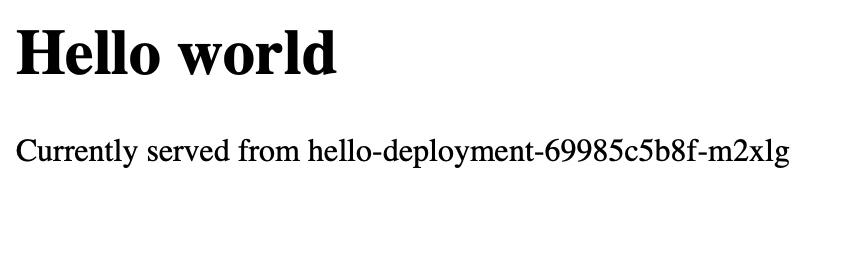
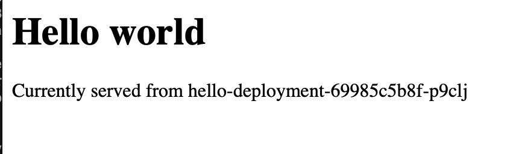

# minikube-setup
Mini kube hello world example

## Prerequisites
In order to use this project, there are a few assumptions:
1. You have minikube installed on your system: [Instructions here](https://kubernetes.io/docs/tasks/tools/install-minikube/)
2. You have docker installed: [Mac setup here](https://docs.docker.com/docker-for-mac/), [Windows setup here](https://docs.docker.com/docker-for-windows/)
3. You have python >= 3.6: [Instructions here](https://www.python.org/downloads/release/python-381/)

## Start up instructions
1. Open terminal
2. Run deploy.sh

### Additional instructions
When the script finishes your default browser will open, however the deployment might take a little bit of time to start up.


You can monitor this using `kubectl get po` from the console

Initially you will see something like this:
```batch
NAME                                READY   STATUS              RESTARTS   AGE
hello-deployment-69985c5b8f-c6mzw   0/1     ContainerCreating   0          0s
hello-deployment-69985c5b8f-vzpvk   0/1     ContainerCreating   0          0s
hello-deployment-69985c5b8f-znmqq   0/1     ContainerCreating   0          0s
```
Or
```batch
NAME                                READY   STATUS              RESTARTS   AGE
hello-deployment-69985c5b8f-c6mzw   0/1     Starting            0          0s
hello-deployment-69985c5b8f-vzpvk   0/1     Starting            0          0s
hello-deployment-69985c5b8f-znmqq   0/1     Starting            0          0s
```

Eventually you would expect to see:
```batch
NAME                                READY   STATUS    RESTARTS   AGE
hello-deployment-69985c5b8f-c6mzw   1/1     Running   0          8m27s
hello-deployment-69985c5b8f-vzpvk   1/1     Running   0          8m27s
hello-deployment-69985c5b8f-znmqq   1/1     Running   0          8m27s
```

## Output
Once the application is running you can refresh the webpage.
You will then see something like:


After hitting refresh a few times, you will see the served from location update:


## Cleaing up
Once you are finished running the app.
Simply open the terminal and run `minikube delete`
 
